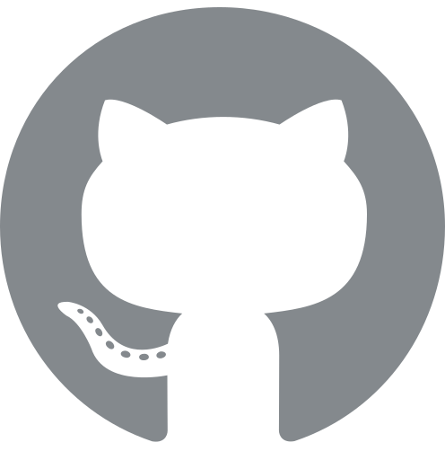

<!--  -->

 

### 🔥 Siegfred Lorelle Mina 
Hello I am **Sig**. I enjoy software development and training AI/ML models. I am currently exploring AI/ML fields such as NLP.

---

  
🛠️ Skills and Languages

   
  

    <!-- Languages -->
    
     
    <!-- DevOps -->
    
     
    <!-- Web Development -->
    
    
     
    <!-- Databases -->
    
     
    <!-- Data and Machine Learning -->
    
    
    
    
    
    
     
    <!-- Others -->
    
    
     
  

---

  
📈 Stats

   
  

    <!-- GitHub Streak Stats -->
     
    <!-- GitHub Contribution Stats -->
    
     
    <!-- WakaTime Stats -->
    
     
    <!-- GitHub Languages -->
    
  

---

  
🐍 Contributions

  <a href="https://raw.githubusercontent.com/SiegfredLorelle/SiegfredLorelle/output/github-contribution-grid-snake.svg"><picture>
  <source media="(prefers-color-scheme: dark)" srcset="https://raw.githubusercontent.com/SiegfredLorelle/SiegfredLorelle/output/github-contribution-grid-snake-dark.svg">
  <source media="(prefers-color-scheme: light)" srcset="https://raw.githubusercontent.com/SiegfredLorelle/SiegfredLorelle/output/github-contribution-grid-snake.svg">
  
  </picture></a>

---

  
📂 Projects

   
  

    <!-- Banana Classification App -->
    <a href="https://github.com/LopezJER/banana-disease-classification-app"><picture>
    <source media="(prefers-color-scheme: dark)" srcset="https://github-readme-stats.vercel.app/api/pin/?username=LopezJER&repo=banana-disease-classification-app&description_lines_count=2&theme=one_dark_pro">
    <source media="(prefers-color-scheme: light)" srcset="https://github-readme-stats.vercel.app/api/pin/?username=LopezJER&repo=banana-disease-classification-app&description_lines_count=2&theme=swift">
    
    </picture></a>
    <!-- Luksong Baka Game -->
    <a href="https://github.com/SiegfredLorelle/cpe40032-Luksong-Baka-2"><picture>
    <source media="(prefers-color-scheme: dark)" srcset="https://github-readme-stats.vercel.app/api/pin/?username=SiegfredLorelle&repo=cpe40032-Luksong-Baka-2&description_lines_count=2&theme=one_dark_pro">
    <source media="(prefers-color-scheme: light)" srcset="https://github-readme-stats.vercel.app/api/pin/?username=SiegfredLorelle&repo=cpe40032-Luksong-Baka-2&description_lines_count=2&theme=swift">
    
    </picture></a>
    <!-- Compiled 50 -->
    <a href="https://github.com/SiegfredLorelle/compiled-50"><picture>
    <source media="(prefers-color-scheme: dark)" srcset="https://github-readme-stats.vercel.app/api/pin/?username=SiegfredLorelle&repo=compiled-50&description_lines_count=2&theme=one_dark_pro">
    <source media="(prefers-color-scheme: light)" srcset="https://github-readme-stats.vercel.app/api/pin/?username=SiegfredLorelle&repo=compiled-50&description_lines_count=2&theme=swift">
    
    </picture></a>
    <!-- Rubiks Solver -->
    <a href="https://github.com/SiegfredLorelle/rubiks-solver"><picture>
    <source media="(prefers-color-scheme: dark)" srcset="https://github-readme-stats.vercel.app/api/pin/?username=SiegfredLorelle&repo=rubiks-solver&description_lines_count=2&theme=one_dark_pro">
    <source media="(prefers-color-scheme: light)" srcset="https://github-readme-stats.vercel.app/api/pin/?username=SiegfredLorelle&repo=rubiks-solver&description_lines_count=2&theme=swift">
    
    </picture></a>
    <!-- Accreditation Website -->
    <a href="https://github.com/stephnic813/accre-website"><picture>
    <source media="(prefers-color-scheme: dark)" srcset="https://github-readme-stats.vercel.app/api/pin/?username=stephnic813&repo=accre-website&description_lines_count=2&theme=one_dark_pro">
    <source media="(prefers-color-scheme: light)" srcset="https://github-readme-stats.vercel.app/api/pin/?username=stephnic813&repo=accre-website&description_lines_count=2&theme=swift">
    
    </picture></a>
    <!-- Library Management App -->
    <a href="https://github.com/SiegfredLorelle/library-management-app"><picture>
    <source media="(prefers-color-scheme: dark)" srcset="https://github-readme-stats.vercel.app/api/pin/?username=SiegfredLorelle&repo=library-management-app&description_lines_count=2&theme=one_dark_pro">
    <source media="(prefers-color-scheme: light)" srcset="https://github-readme-stats.vercel.app/api/pin/?username=SiegfredLorelle&repo=library-management-app&description_lines_count=2&theme=swift">
    
    </picture></a>
    <!-- Personal Website -->
    <a href="https://github.com/SiegfredLorelle/personal-website"><picture>
    <source media="(prefers-color-scheme: dark)" srcset="https://github-readme-stats.vercel.app/api/pin/?username=SiegfredLorelle&repo=personal-website&description_lines_count=2&theme=one_dark_pro">
    <source media="(prefers-color-scheme: light)" srcset="https://github-readme-stats.vercel.app/api/pin/?username=SiegfredLorelle&repo=personal-website&description_lines_count=2&theme=swift">
    
    </picture></a>
    <!-- PUP Hymn Karaoke -->
    <a href="https://github.com/SiegfredLorelle/pup-hymn-karaoke"><picture>
    <source media="(prefers-color-scheme: dark)" srcset="https://github-readme-stats.vercel.app/api/pin/?username=SiegfredLorelle&repo=pup-hymn-karaoke&description_lines_count=2&theme=one_dark_pro">
    <source media="(prefers-color-scheme: light)" srcset="https://github-readme-stats.vercel.app/api/pin/?username=SiegfredLorelle&repo=pup-hymn-karaoke&description_lines_count=2&theme=swift">
    
    </picture></a>
    <!-- Transcript Generation System -->
    <a href="https://github.com/edgarpesguerrajr/transcript-generation-system"><picture>
    <source media="(prefers-color-scheme: dark)" srcset="https://github-readme-stats.vercel.app/api/pin/?username=edgarpesguerrajr&repo=transcript-generation-system&description_lines_count=2&theme=one_dark_pro">
    <source media="(prefers-color-scheme: light)" srcset="https://github-readme-stats.vercel.app/api/pin/?username=edgarpesguerrajr&repo=transcript-generation-system&description_lines_count=2&theme=swift">
    
    </picture></a>
    <!-- Contact Tracing App -->
    <a href="https://github.com/SiegfredLorelle/contact-tracing-app"><picture>
    <source media="(prefers-color-scheme: dark)" srcset="https://github-readme-stats.vercel.app/api/pin/?username=SiegfredLorelle&repo=contact-tracing-app&description_lines_count=2&theme=one_dark_pro">
    <source media="(prefers-color-scheme: light)" srcset="https://github-readme-stats.vercel.app/api/pin/?username=SiegfredLorelle&repo=contact-tracing-app&description_lines_count=2&theme=swift">
    
    </picture></a>
    <!-- Address Book -->
    <a href="https://github.com/SiegfredLorelle/address-book"><picture>
    <source media="(prefers-color-scheme: dark)" srcset="https://github-readme-stats.vercel.app/api/pin/?username=SiegfredLorelle&repo=address-book&description_lines_count=2&theme=one_dark_pro">
    <source media="(prefers-color-scheme: light)" srcset="https://github-readme-stats.vercel.app/api/pin/?username=SiegfredLorelle&repo=address-book&description_lines_count=2&theme=swift">
    
    </picture></a>
    <!-- Candy Machine GUI App -->
    <a href="https://github.com/SiegfredLorelle/candy-machine-gui-ver"><picture>
    <source media="(prefers-color-scheme: dark)" srcset="https://github-readme-stats.vercel.app/api/pin/?username=SiegfredLorelle&repo=candy-machine-gui-ver&description_lines_count=2&theme=one_dark_pro">
    <source media="(prefers-color-scheme: light)" srcset="https://github-readme-stats.vercel.app/api/pin/?username=SiegfredLorelle&repo=candy-machine-gui-ver&description_lines_count=2&theme=swift">
    
    </picture></a>
  

---

  
👨🏻‍💻 My Story

Hello, I am **Siegfred Lorelle C. Mina**, people usually call me **Sig**. I am a 3rd-year computer engineering student at Polytechnic University of the Philippines - Sta. Mesa.

I was introduced to programming before college, although I started to truly appreciate it in my freshmen years.

I enjoy programming, and now it has become a hobby. In my spare time, I try to work on personal projects, take online courses, or solve LeetCode questions.

I love the challenge, the sense of accomplishment when solving a complicated problem, the broadness of the field, and the never-ending ways to solve and optimize solutions. There is so much to learn in programming.

This passion brought me to school organizations that share the same hobbies such as **Google Developer Student Club - PUP**. It allowed me and other members of the organization to explore different fields, hone our skills, collaborate with peers, and overall gain experiences.

---

  
🔗 Socials

  

    
    
    
    
    
     
  

