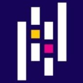
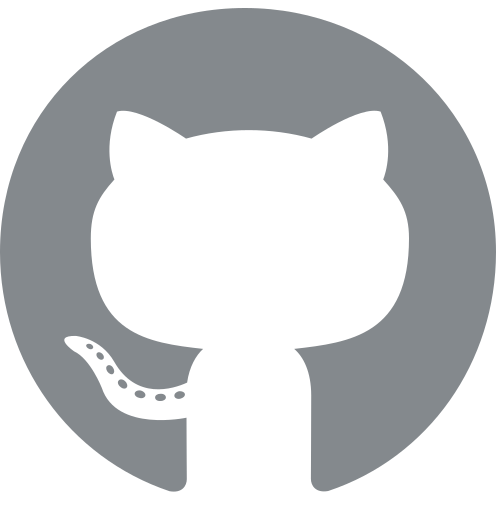
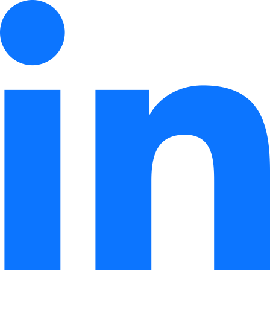

# WIP

### 🔥 Siegfred Lorelle Mina
Hello I am **Sig**. I enjoy software development and training AI/ML models. I am currently exploring AI/ML fields such as NLP.

---

<!-- ### 🛠️ Skills and Languages -->

🛠️ Skills and Languages

    <!-- Languages -->
    
     
    <!-- DevOps -->
    
     
    <!-- Web Development -->
    
    
     
    <!-- Databases -->
    
     
    <!-- Data and Machine Learning -->
    
    
    
    
    
    
     
    <!-- Others -->
    
    
     

---

### 🔗 Socials

 

---

📈 Stats

TODO: socials here

---

🐍 Contributions

TODO: socials here

---

📂 Projects

TODO: projects here

---

👨🏻‍💻 My Story

TODO: story here

<!-- 
TODOS:
- Finish skills
    - Add missing icons
    - Use better icons for light and dark mode
- Add infos on stats
- Add infos on projects
- Add infos on my journey
- Toggle dropdown for stats, projects & journey
- Add top commits badge
- Convert skills and socials to be dropdown
 -->
<!--
**SiegfredLorelle/SiegfredLorelle** is a ✨ _special_ ✨ repository because its `README.md` (this file) appears on your GitHub profile.

Here are some ideas to get you started:

- 🔭 I’m currently working on ...
- 🌱 I’m currently learning ...
- 👯 I’m looking to collaborate on ...
- 🤔 I’m looking for help with ...
- 💬 Ask me about ...
- 📫 How to reach me: ...
- 😄 Pronouns: ...
- ⚡ Fun fact: ...
-->
